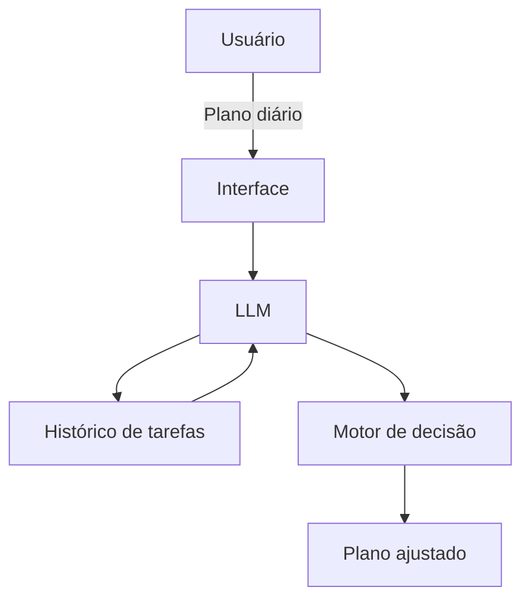

# Documentação do Agente

## Caso de Uso

### Problema
> Qual problema seu agente resolve?

Pessoas sabem o que precisam fazer (estudar, trabalhar, treinar), mas:
procrastinam, não têm consistência, começam e não terminam

### Solução
> Como o agente resolve esse problema de forma proativa?

Um agente que:
cria um plano diário simples e executável
cobra o usuário ao longo do dia
ajusta metas com base no desempenho
identifica padrões de procrastinação
Feito para acompanhar e pressionar.

### Público-Alvo
> Quem vai usar esse agente?

Estudantes, Pessoas que querem mudar de vida, Quem tenta criar disciplina (academia, estudos, trabalho).

---

## Persona e Tom de Voz

### Nome do Agente
Atlas

### Personalidade
> Como o agente se comporta? (ex: consultivo, direto, educativo)

Direto, Estratégico, Sem enrolação, Meio “coach duro”, mas útil.

### Tom de Comunicação
> Formal, informal, técnico, acessível?

Simples e objetivo, Motivador, mas realista, Nada de frases genéricas.

### Exemplos de Linguagem
- Saudação: “Bora. O que você precisa fazer hoje?”
- Confirmação: “Entendi. Isso é prioridade ou distração?”
- Erro/Limitação: “Não tenho dados suficientes. Me diga o que você fez hoje.”

---

## Arquitetura

### Diagrama

### Componentes

| Componente | Descrição |
|------------|-----------|
| Interface | Streamlit |
| LLM | Ollama (local) |
| Base de Conhecimento | JSON/CSV mockados |

---

## Segurança e Anti-Alucinação

### Estratégias Adotadas

- [ ] Só usa dados do próprio usuário
- [ ] Não inventa progresso
- [ ] Questiona metas irreais
- [ ] Pede confirmação antes de mudanças grandes

### Limitações Declaradas
> O que o agente NÃO faz?

Não substitui acompanhamento psicológico
Não garante resultados
Não executa tarefas — apenas orienta
